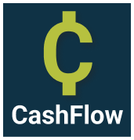
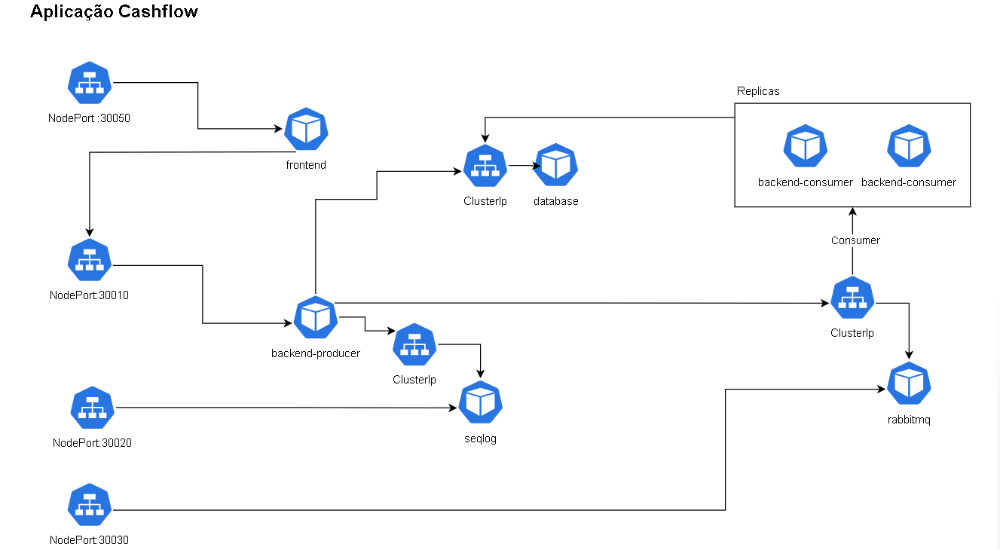

# Cashflow
> Aplicação de fluxo de caixa

O Cashflow é uma aplicação desenvolvida com base no padrão de Domain Driven Design (DDD) e orientada a eventos e vertical slices. Suas funcionalidades abrangem desde a listagem de transações operacionais até o cadastro de novas transações.

## Backend
Desenvolvido utilizando o DotNet Core 6, este projeto foi concebido com foco na escalabilidade, graças ao seu design arquitetônico que promove o desacoplamento de seus componentes, permitindo que cresçam de forma flexível conforme a necessidade.
Fora utilizado, nesse exemplo, um produtor para dois consumidores, de forma a separar os tipos de transações no fluxo de banco de dados. Esse padrão CQRS, permite que os Comandos, possam ser desvinculados das Queries.
Nesse, exemplo, existe a separação, mas por questão de processamento e máquina, não apliquei réplicas ReadOnly no SQLServer, dos quais seriam complementares ao exemplo das Queries.
O endpoint de Operations GET faz as solicitações de queries, e o endpoint de Operations POST produz um evento, do qual é consumido em pods fora da stack. Essa segregação foi feita atravez de uma Feature Flag para controle da assinatura do consumidor:
```c#
  services.AddMassTransit(mass =>
  {
      if (featureConsumerOperationsOn)
          mass.AddConsumer<ConsumerCreateOperation>();

      mass.UsingRabbitMq((context, config) => ...
```

Através do uso desta variável de ambiente, escalamos os PODs conforme nossa demanda, como especificado no script do Kubernetes.[backend-consumer-configmap.yaml](https://github.com/jeanpuga/cashflow/blob/main/installation/backend-consumer/backend-consumer-configmap.yaml), no trecho abaixo:

```json
   FeatureFlags__ConsumeOperationsFeatureOn: "true"
```


## Frontend

O frontend deste projeto foi cuidadosamente concebido usando React com TypeScript, incorporando os princípios das tendências modernas do mercado, que são sempre bem-vindas e, muitas vezes, influenciam a estrutura do código no dia a dia. Além disso, optei por utilizar 'Create React App' ([CRA](https://pt-br.legacy.reactjs.org/docs/create-a-new-react-app.html)), que é uma ferramenta popular para iniciar projetos em React com facilidade e rapidez, garantindo um ponto de partida sólido.

Para a estilização, fiz uso do Styled Components, que oferece uma abordagem eficiente para a criação de estilos em componentes React, permitindo uma estilização mais flexível e modular. Além disso, adotamos o Material-UI ([MUI](https://mui.com/)) para React, uma biblioteca que proporciona um design moderno e responsivo, enriquecendo a experiência do usuário.

A aplicação também implementa a API Context do React como gerenciador de estados da interface, tornando a gestão de dados e interações na aplicação mais eficiente e facilitando a comunicação entre os diferentes componentes da interface.


## Instalação
Para executar a aplicação Cashflow, é necessário que a máquina tenha o sistema operacional Windows, além de ter instalados o Docker, o Kubernetes e o Dotnet Core na Versão 6. Vale a pena acentuar que a aplicação é toda multi-plataforma, por em devido a espa;o em disco, não criei um .sh e por essa conta, não testei em ambiente Linux, "ainda". 

### Buildar Imagens
As imagens estão publicamente acessíveis no [DockerHub](https://hub.docker.com/search?q=jeanpuga), onde você pode encontrar todas as imagens disponíveis. No entanto, caso surjam necessidades específicas ou curiosidades, a seguir, forneço a seguir as instruções para a manutenção.


#### Backend
Para compilar a aplicação do Backend, você pode optar por abri-la no Visual Studio e pressionar simultaneamente as teclas CTRL + SHIFT + B, ou, de forma mais simplificada, executar o arquivo DOCKERFILE. No entanto, essa abordagem vai além dessa etapa e inclui a assinatura da imagem no Docker, bem como o envio da imagem para o DockerHub. Para realizar esse processo de forma fácil, basta utilizar o arquivo [publish.bat](https://github.com/jeanpuga/cashflow/backend/publish.bat), que está localizado na pasta do backend.

É importante notar que, uma vez que a geração da imagem esteja concluída, o tagueamento da imagem é realizado no nome do usuário logado no DockerHub. Portanto, posteriormente na documentação, será necessário atualizar os nomes das imagens nos arquivos de configuração do Kubernetes (scripts de k8s) para refletir a mudança de nome da imagem."

#### Frontend
No que diz respeito ao frontend, é importante notar que as variáveis de ambiente definidas no Kubernetes não são automaticamente acessíveis à aplicação. Isso se deve ao fato de que os transpiladores, que incluem codificadores e minificadores, executam a obfuscação durante a etapa de compilação. Portanto, caso seja necessária alguma manutenção das variáveis de ambiente, isso deve ser feito antes do processo de compilação. Você pode encontrar essas variáveis de ambiente nos arquivos de 'DOT ENV de produção' [.env.production](https://github.com/jeanpuga/cashflow/blob/main/frontend/.env.production).

Para executar os comandos necessários, siga as instruções abaixo no prompt de comando, a partir do diretório do frontend:

Para instalação de dependências:

```bash
   npm start
```
Para realizar a compilação:

```bash
   npm run build
```
O segundo comando mencionado acima irá transpilar o código do frontend em um arquivo JavaScript minificado e compacto.

Uma vez que o processo de compilação esteja concluído e o resultado tenha sido criado na pasta './frontend/build', você pode acelerar ainda mais o processo fazendo uso de um arquivo batch. Localize o arquivo 'publish.bat' na pasta do frontend e execute-o."


### Deploiar a aplicação sem refazer as imagens
Para deploiar a aplicação, basta ir a pasta [installation](https://github.com/jeanpuga/cashflow/blob/main/installation) e executar o arquivo [install.bat](https://github.com/jeanpuga/cashflow/blob/main/installation/install.bat). Esse irá executar a subida do planejamento orquestrado para o kubernetes.


### Deploiar a aplicação refazendo as imagens
Para renovar o deploy nas imagend é necessário trocar seus nomens dentro de dois scripts:
- [backend-consumer-pod](https://github.com/jeanpuga/cashflow/blob/main/installation/backend-consumer/backend-consumer-pod.yaml)
- [backend-producer-pod](https://github.com/jeanpuga/cashflow/blob/main/installation/backend-producer/backend-producer-pod.yaml)

Note que no campo imagem, o nome do usuário logado, se destaca, é nesse ponto que iremos atuar a substituição, segue o exemplo abaixo:

```yaml

    spec: 
      containers:
      - name: backend-consumer-container
        image: jeanpuga/cashflow-backend:latest
        ports:

```
Uma vez realizado, os renames, basta rodar o passo anterior "[Deploiar a aplicação sem refazer as imagens](https://github.com/jeanpuga/cashflow#deploiar-a-aplica%C3%A7%C3%A3o-sem-refazer-as-imagens)"

### Banco de dados, DDL e DML
Existem duas abordagens para implantar os scripts: uma delas envolve o uso da linha de comando do Bash, enquanto a outra pode ser realizada por meio de alguma aplicação de SQL que você, caro leitor deste artigo, possa ter instalada. É importante destacar que o sistema de gerenciamento de banco de dados utilizado é o SQL Server, o que implica que não é tão agnóstico quanto gostaríamos para esta seção, mas, ainda assim, atende de forma eficiente aos requisitos do exercício.

#### Por bash
Para realizar a implantação da aplicação, é necessário entrar dentro do POD e executar um comando específico. O comando para entrar em um POD é o seguinte:
```bash
kubectl exec -it deployment.apps/database-pod1  -- bash 
```
Uma vez dentro do ambiente Linux da máquina virtualizada, você deve executar a seguinte sentença para criar o banco de dados:
```bash
/opt/mssql-tools/bin/sqlcmd -S localhost -U SA -P '1q2w3e4r@#$' -Q 'CREATE DATABASE Cashflow'
```

Em seguida, use o comando "exit" para sair do ambiente Linux e retornar ao Windows.

Após a criação do banco de dados, você precisará localizar o POD de database no Kubernetes e executar uma cópia de um script SQL para dentro do POD. Para obter o nome físico do POD, execute o comando:
```bash
kubectl get pod
```

Com o nome do POD em mãos, você pode copiar o script para o ambiente Linux com o seguinte comando:
```bash
kubectl cp ..\backend\script\20231010_DUMP.sql database-pod1-65d49c69f-dtcxc:/tmp/
```

Uma vez que a cópia esteja concluída, retorne novamente dentro do POD para executar o script:
```bash
kubectl exec -it deployment.apps/database-pod1  -- bash

/opt/mssql-tools/bin/sqlcmd -S localhost -U SA -P '1q2w3e4r@#$' -d Cashflow -i ./tmp/20231010_DUMP.sql
```

Após a conclusão deste processo, o sistema estará pronto para uso.


#### Por interface gráfica
Basta logar na maquina virtualizada em localhost:31433, e executar os dois scripts que sencontram na pasta, do backend/scripts.

-Primeiro
```bash
  20231010_CREATEDATABASE.sql
```

-Segundo
```bash
  20231010_DUMP.sql
```
### Usuários
Para se logar ao sistema existe um usuário criado, basta utiliza-lo. 
exemplo:
 ```json
  {
    "user": "jean.puga@cashflow.com",
    "password": "123456"
  }
```

## Portas e instalações



## Agradecimentos
Obrigado ao pessoal da consultoria por dispor o tempo de criação para essa aplicação.

## Contribuições
Contribuições são sempre bem vindas para esse artigo.

## Licensa
[ Por hora esse código está em direito público, e segue para contribuições.
